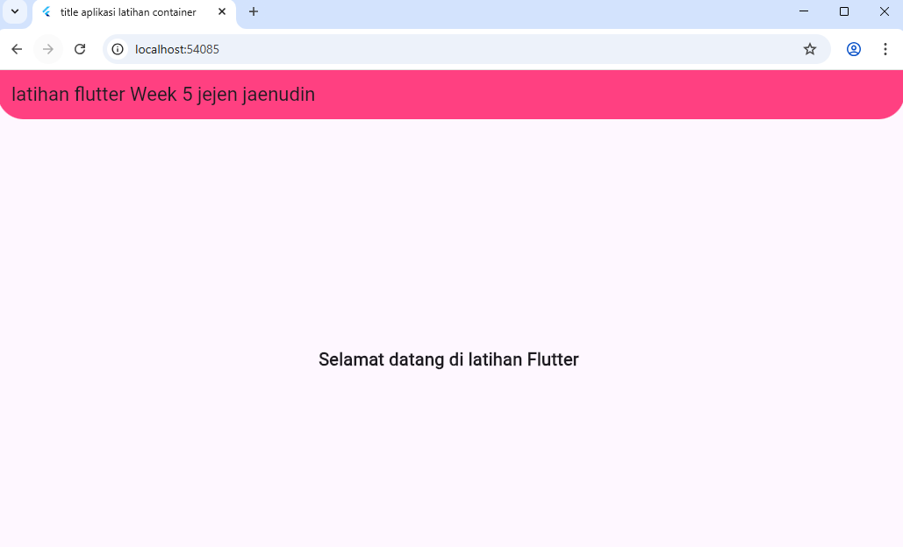
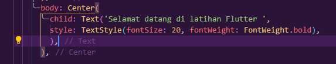
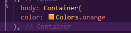
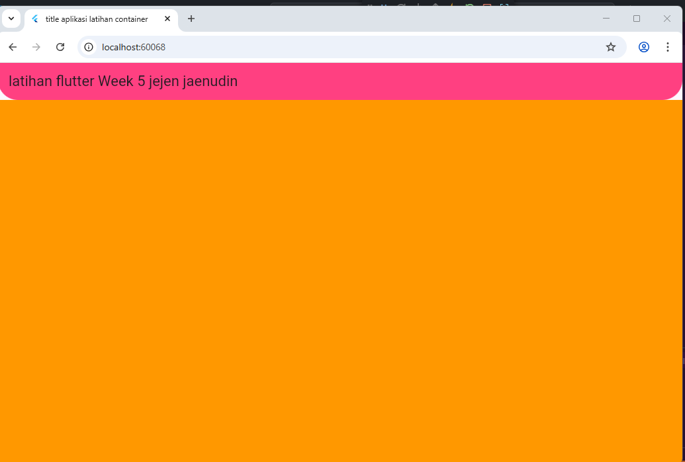
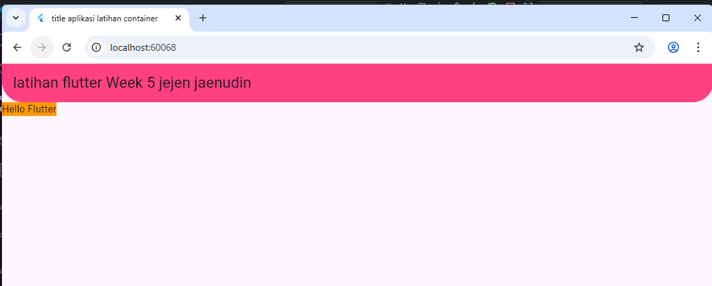
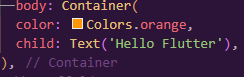
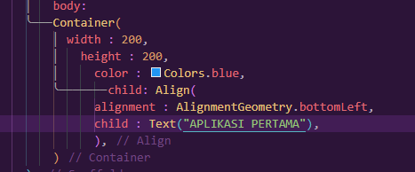
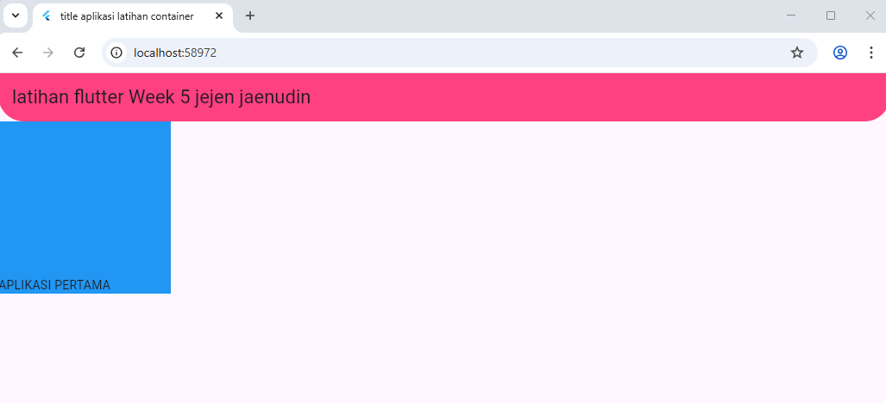

# tugas_week_5

Projeck week 5
## Getting Started
1. Membuat my app
2. membuat StatelessWidget
3. membuat class MyHome
4. penambahan body pada widget scaffold

5.membuat container

6. Kemudian dirubah seperti ini dengan tambahan child , maka akan mengecil
mengikuti ukuran child, karena pada container tidak punya alignment atau
size.

7. alignment (AlignmentGeometry)
alignment adalah properti untuk mengatur posisi(letak)
Mengatur posisi child di dalam Container.

8. pembuatan Container dengan child layout row atau column

"# Tugas_week_5_-1125170031-" 
